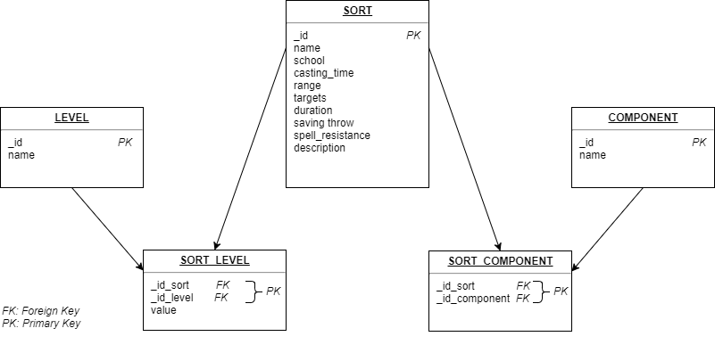

# uqac-bdd-devoir1

<h2>Rapport du devoir 1 de Bases de données réparties - Hiver 2018</h2>
<b>David Delemotte, Paul Michaud, Rénald Morice, Loïc Bothorel</b>

<h3>Exercice 1</h3>

<h4>Installation du projet</h4>

Se placer dans le dossier exercice1/javascript et installer les dépendances avec la commande suivante :

```
npm install
```

---

<h4>Question 1</h4>

**`Prérequis`** avoir MongoDB de lancé.<br/>
**`Lancement`** lancer la commande <i>node crawler.js mongodb</i> pour faire le crawling et l'insertion des données dans une base MongoDB.

**`Ce qui a été fait`**

- [x] Crawler réalisé en Node.js en utilisant le site web : http://www.dxcontent.com
- [x] Enregistrement des données dans une base MongoDB (le crawler appelle la fonction <i>insertMongoDB</i> du script <i>insertSpells.js</i>).

---

<h4>Question 2</h4>

**`Prérequis`** avoir exécuté le code de la Question 1 pour que les données soient enregistrées dans mongoDB<br/>
**`Lancement`** lancer la commande <i>node getSpellsMongoDB.js</i>

**`Ce qui a été fait`**

- [x] Code MapReduce pour récupérer les bons sorts pour libérer Pito.

**`Résultats et réponse à la question`**

| ID Sort | Nom Sort |
| ------- | -------- |
| 50 | Blindness/Deafness |
| 52 | Blur |
| 148 | Dimension Door |
| 198 | Feather Fall |
| 212 | Flare |
| 232 | Geas | Lesser |
| 272 | Hold Portal |
| 308 | Knock |
| 487 | Shout |
| 623 | Dweomer Retaliation |
| 624 | Emergency Force Sphere |
| 643 | Liberating Comand |
| 654 | Chastise |
| 658 | Sotto Voce |
| 774 | Flare Burst |
| 875 | Spark |
| 1133 | Steal Voice |
| 1326 | Liberating Command |
| 1444 | Buoyancy |
| 1662 | Anti-Summoning Shield |
| 1805 | Storm Step |
| 1866 | Buoyancy |
| 1937 | Silent Table |
| 1952 | Sundering Shards |
| 1967 | Wave Shield |

<b>Remarque :</b> le sort "Liberating Comand" (ID : 643) est mal orthographié, d'où la présence d'un doublon "Liberating Command" (ID :1326) !

- [x] Réponse à la question: le sort choisi par les experts pour libérer Pito est <b>Dimension Door (ID : 148)</b>.

---

<h4>Question 3</h4>

**`Lancement`** lancer la commande <i>node crawler.js sqlite</i> pour faire le crawling et l'insertion des données dans une base SQLite, puis la commande <i>node getSpellsSQLlite.js</i> pour récupérer les sorts valides pour libérer Pito.

**`Ce qui a été fait`**

- [x] Enregistrement des données dans une base SQlite (le crawler appelle la fonction <i>insertSQlite</i> du script <i>insertSpells.js</i>).
- [x] Schéma plus complexe avec plusieurs tables (voir schéma plus bas).
- [x] Requête SQL pour récupérer les bons sorts pour libérer Pito (<i>exercice1/js/getSpellsSQlite.js</i>)

Le schéma est le suivant (une table <b>sort</b>, une table <b>level</b> (1 à n levels par sort) et une table <b>components</b> (1 à n components par sort). En raison des liaisons plusieurs à plusieurs, il est nécessaire de créer deux tables supplémentaires: 
<b>sort_level</b> et <b>sort_component</b>).



---

<h4>Version en Python</h4>

Nous avons également réalisé une partie de cet exercice en python, dans le dossier <i>exercice1/python</i> pour comparer langage synchrone/langage asynchrone.

**`Prérequis`** Se placer dans <i>exercice1/python</i>

```
# apt install python-pip
$ pip install beautifulsoup4
$ pip install lxml
```

**`Ce qui a été fait`**

- [x] Crawler en python (lancer <i>exercice1/python/crawler.py</i>) en utilisant http://www.dxcontent.com

```
python crawler.py
```

- [x] Insertion dans la base SQlite (lancer <i>exercice1/python/insertSqlite.py</i>)

```
python insertSqlite.py
```

- [x] Récupération des sorts (lancer <i>exercice1/python/getSpellsSQlite.py</i>)

```
python getSpellsSQlite.py
```

**`Résultats`**

Les sorts trouvés en résultat sont les mêmes qu'avec la version Node.js.

---

<h3>Exercice 2</h3>

L'exercice 2 a été réalisé en node.js (exercice2/pagerank.js). 

**`Prérequis`** Se placer dans <i>exercice2/</i> et installer le module MongoDB.

```
npm install mongodb --save
```

**`Ce qui a été fait`**

- [x] Calcul du Page Rank 

```
node pagerank.js
```

**`Résultats`**

Les Page Ranks calculculés sont bien ceux de l'énoncé.
